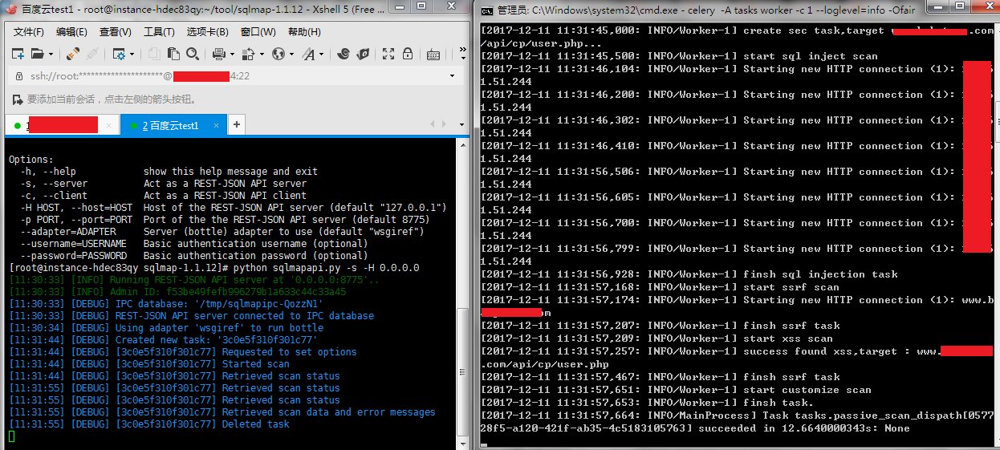

# PassiveSecCheck 0.1

自动化被动扫描系统分为数据源、数据处理、漏洞验证等三个子系统，本系统属于漏洞验证系统部分，根据提供的数据进行分布式安全验证，确定是否包含相关严重漏洞。

## Author ##

咚咚呛 

如有其他建议，可联系微信280495355

## Support ##

满足如下安全需求

	1、对提供的http协议的五个元素进行安全测试(协议、方法、host、接口、参数)
	2、可提供host和session对照表，用于登录后测试
	3、提供自定义规则扫描，用于测试越权漏洞和常见漏洞等

技术细节如下：

	1、接受数据源为json格式,以含五元素为主
	2、分布式采用Celery + Redis结构
	2、提供SQL注入、SSRF、XSS等检测,其中SSRF的检测，原理是把相关参数替换为指定的链接信息，然后读取此web日志，确定漏洞
	3、扫描结果以KV数据存储到Redis中
	4、提供参数替换接口、防止参数中出现session等值
	5、提供host和session对照接口，可事实进行测试替换
	6、提供白名单接口，可无条件放过测试
	7、提供自定义规则接口，进行自定义漏洞检测，主要用于越权和常见漏洞检测

## Test Environment ##

>Windows 7 旗舰版 / centos 7
>
>python 2.7.5

## Tree ##

	PublicSecScan
	----lib                #模块库文件
	----log                #日志目录
	----tasks.py   		   #分布式调度任务
	----run.py   		   #任务分发主程序，用于测试
	----nginxlog.py		   #SSRF漏洞验证，用于读取nginx访问日志

## Deploy ##
	
	部署分为两块，一个扫描任务执行Worker、一个是ssrf漏洞验证Worker

	1、任意机子安装redis
	$ yum install redis
	$ vim /etc/redis.conf
	# 更改bind 127.0.0.1 改成了 bind 0.0.0.0
	# 添加一行requirepass xxxxx密码
	# 修改daemonize yes
	$ redis-server /etc/redis.conf
	
	2、Worker部署(建议以centos为主)
	1） pip install -r requirements.txt
	2） 下载sqlmap，并执行 nohup python sqlmapapi.py -s &
	2） 配置./lib/config.py 文件，填入Redis和其他等相关信息
	3） cmd代码目录执行，-c 1代表多一个worker进程，可增加：
	celery -A tasks worker -c 1 --loglevel=info -Ofair
	
	3、找一台机子部署ssrf验证worker
	1） pip install nginx
	2） 配置/etc/nginx 文件，修改如下：log_format  main '$request';
	4） 写文件cron.d定时执行python nginxlog.py

## Config ##

配置目录：./lib/config.py

	# redis信息
	REDIS_HOST = '182.11.11.11'
	REDIS_PORT = 6379
	REDIS_PASSWORD = 'xxxxxx'
	REDIS_DB = 1
	# 配置参数中的替换字符，防止参数中出现session权限判断等
	conf_parameter_json = {
	    'session': '12234234234'
	}
	# 维持一个sesson访问列表
	conf_cookies = [
	    {'domain': '*.test.com', 'cookie': 'session=111111'},
	    {'domain': 'www.test.com', 'cookie': 'session=1111112222'},
	    {'domain': 'abc.testabc.com', 'cookie': 'session=1234'}
	]
	# 白名单路径，路径中出现如/admin不进行任何安全检测
	conf_white_path = ['/admin', '/administra']
	# 自定义漏洞匹配规则,遍历每个参数名称，当设定parameter时，值替换为设定的value字串，并在response中匹配正则rule
	# 不设定parameter时，代表挨个替换
	# 可以测试一些越权操作和一些常见漏洞
	# 比如设定参数名为phone，替换其参数值为手机号，并匹配response的body内，是否出现此人的个人信息。
	conf_rule = [
	    {'value': '17600296111', 'rule': 'xxxxxxxxx', 'name': 'Exceed Permissions', 'parameter': 'phone'},
	    {'value': '17600296673', 'rule': 'xxxxxxx', 'name': 'Exceed Permissions', 'parameter': 'phone'}
	]
	# server sqlmap远程ip链接
	sqlmap_server = 'http://127.0.0.1:8775/'
	# SQL检测最大运行时间(S)
	sqlmap_max_time = 600
	# db_type数据库检测类型，选填
	sqlmap_db_type = ''
	# sqlmap扫描等级和风险，选填
	sqlmap_level = 1
	sqlmap_risk = 1
	# ssrf_server远程ip或domain
	# ssrf实质是服务端访问了客户端传递的地址
	# 预先搭建一台web，收集分析日志可以判断ssrf触发点。
	ssrf_server = '192.168.1.3'
	# ssrf web日志路径
	ssrf_logpath = '/var/logs/nginx/access.log'

## Worker Screenshot ##

